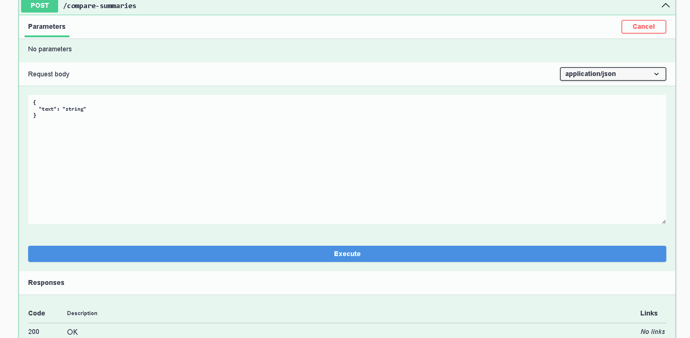

# 🤖 AI Summarizer Comparison 

Welcome to the **AI Summarizer Comparison App** – a fun and educational project built to explore and compare the power of AI models in text summarization.

## 📌 Why I Made This

Artificial Intelligence is shaping the future. I built this app as a **small experiment** to play with powerful open-source summarization models. The goal is to:

- Understand how different free AI models summarize text.
- Compare the performance of each model on various text types.
- Show that even a simple app can demonstrate AI's capabilities in natural language processing (NLP).

## 💡 What It Does

- ✅ You paste or upload a long piece of text
- ✅ The app sends it to multiple **AI summarizer models**
- ✅ You get the summary from each model and compare them

It works great with:

- 📚 Scientific articles
- 🧠 Funny or sarcastic texts
- 🕊️ History and political topics (e.g. **Free Palestine**)

## 🧠 AI Models Used

Currently using:

- `facebook/bart-large-cnn`
- `google/pegasus-cnn_dailymail`
- `sshleifer/distilbart-cnn-12-6`
- `philschmid/bart-large-cnn-samsum`

- (You can add more free models from [Hugging Face](https://huggingface.co/models?pipeline_tag=summarization&sort=downloads))

## 🛠️ Tech Stack

- ⚛️ Frontend: React
- 🌐 Backend: ASP.NET Core Web API
- 📦 Models from HuggingFace Hub
- 🧪 Sample test texts (science, history, fun)

## 📁 Folder Structure

summarize-compare/
 - ai-notes-summarizer-frontend/ # Frontend (React)
 - AiNotesSummarizerApi/ # Backend (ASP.NET Core)
 - compare-data/ # Example long texts and images
 - README.md
 - .gitignore

## 🚀 How to Run

1. **Clone the repo**

```bash
git clone https://github.com/asmaa-elfatayry/summarize-compare-ai-models.git
```

2. Set up your Hugging Face API Token

Create a token from: https://huggingface.co/settings/tokens

Add it in the backend settings:

Option 1: Add it to appsettings.json:

```bash
}
  "HuggingFace": {
    "Token": "your-huggingface-token-here"
  }
}
```

3. Run the Backend (.NET Core API)

- cd AiNotesSummarizerApi
- dotnet restore
- dotnet run

📷 Swagger Screenshot
 - You can view the API documentation via Swagger once the backend runs.



4. Run the Frontend (React)
- cd ai-notes-summarizer-frontend
- npm install
- npm start


📄 License

This project is for educational and experimental use. Feel free to fork it and improve it!
Made with curiosity and a passion for learning and improvement.
